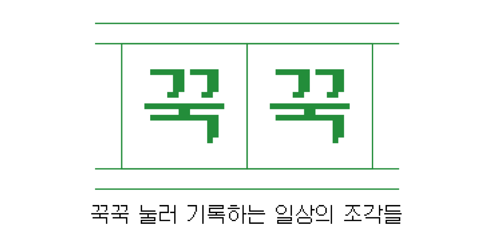
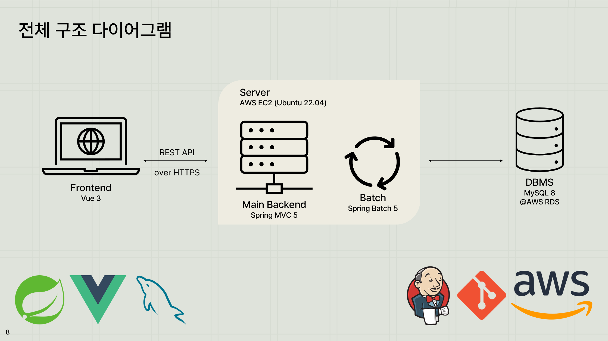

# 꾹꾹 프론트엔드

2022-2023 한국소프트웨어산업협회 기업멤버십 SW 캠프  
최종 프로젝트
팀 기록자들

- 꾹꾹은 일상을 기록하고 공유하는 편리한 방법을 제공하는 플랫폼으로, 지인 지향형 소셜미디어입니다.
- 사용자는 어플리케이션을 따로 설치하지 않고 웹 환경에서 이미지, 비디오, 음성 등의 미디어를 통해 자신의 일상을 손쉽게 아카이빙할 수 있습니다.
- 아카이빙 특화 기능
    - 1달에 한 번 사용자별로 가장 많이 사용한 키워드를 추출하고, 해당 키워드와 연관된 색상을 추천해 UI에 적용하는 기능이 있습니다
        - 스프링 배치로 작성된 별도의 배치 프로그램
        - 키워드 추출: TextRank 알고리즘 활용
        - 색상 추천: Open AI Completion API 연계
- 프라이빗한 SNS 기능
    - 일상 아카이브가 주 목적이 되는 플랫폼이므로, 프라이빗함을 살려 친구 관계 등을 제한적으로 기획하였습니다.
    - 다만 폐쇄적 서비스의 특성상 악용 우려가 뒤따르기 때문에 사용자 콘텐츠의 유해성을 검사하는 기능이 있습니다.
        - 스프링 배치로 작성된 별도의 배치 프로그램
        - 지원 미디어: 이미지, 비디오 (1초 간격으로 스냅샷 생성 후 검사)
        - 유해성 검사: Amazon Rekognition AI 연계

